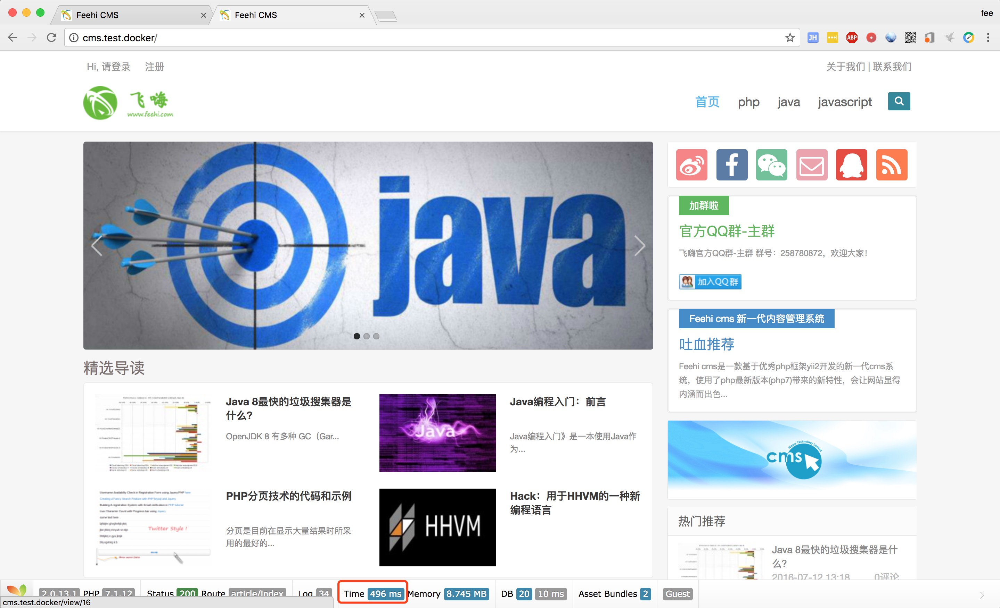
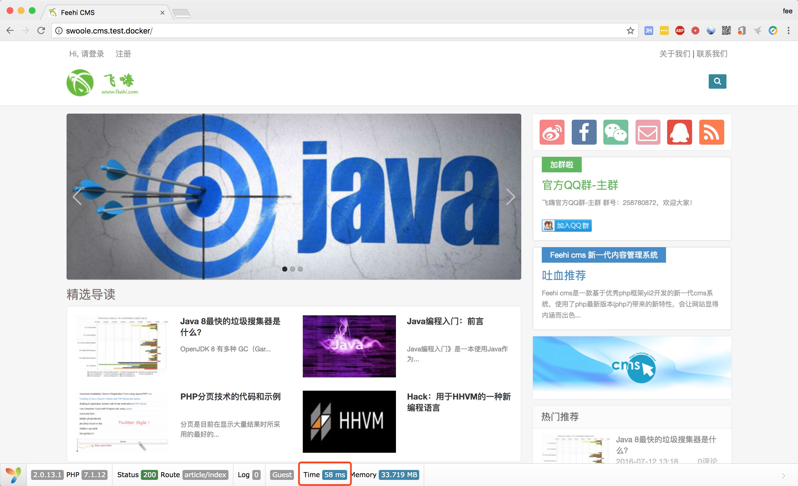
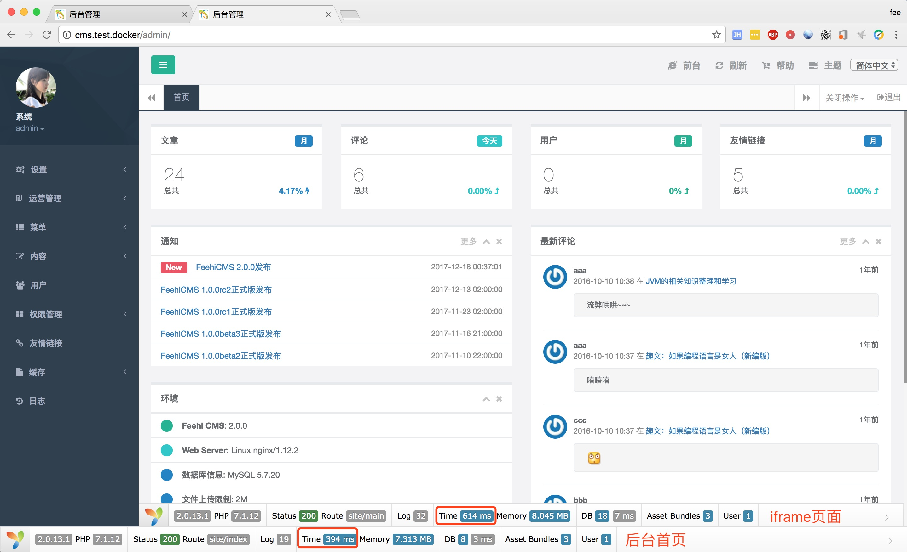
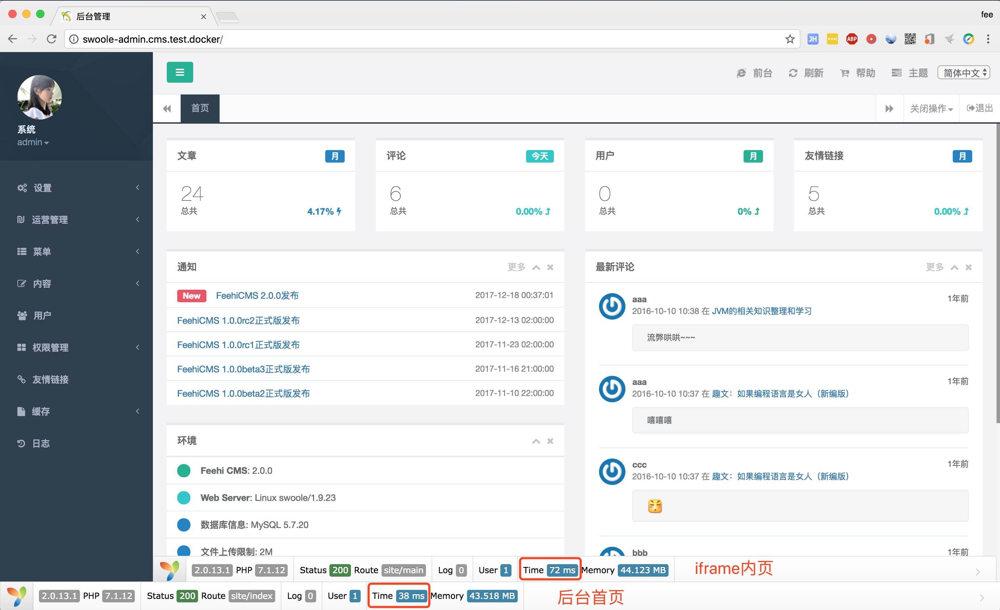

yii2 swoole
===============================

让yii2运行在swoole上。如果您在使用中遇到问题或者想学习yii2结合swoole可以加qq群258780872一起讨论


性能
----------------
运行在swoole上的yii2是运行在php-fpm上yii2的5倍以上，而且一句代码也不用修改。
 
 
在线demo性能体验
----------------
各个演示站点后台   **用户名:feehicms 密码123456**
  * php7.1.8 (php-fpm+nginx+yii2)
    * 前台[http://demo.cms.qq.feehi.com/](http://demo.cms.qq.feehi.com)
    * 后台1[http://demo.cms.qq.feehi.com/admin](http://demo.cms.qq.feehi.com/admin)
  * php7.1.8 (swoole+nginx+yii2)
    * 前台[http:/swoole.demo.cms.qq.feehi.com/](http://swoole.demo.cms.qq.feehi.com)
    * 后台[http://swoole-admin.demo.cms.qq.feehi.com/](http://swoole-admin.demo.cms.qq.feehi.com)

以上demo均采取同一[docker镜像](https://www.github.com/liufee/docker)部署，docker容器运行在同一服务器上，分配相同的资源。

这里用作比较的demo是采用yii2框架开发的一款cms系统[FeehiCMS](http://www.github.com/liufee/cms)，因为FeehiCMS只开发基础cms功能，未对yii框架做任何封装、改造，故选择此作为体验demo。
 

yii2-swoole和php-fpm下的FeehiCMS
---------------
使用yii2自带的yii2-debugger，比较后端响应时间。

因yii2使用YII_BEGIN_TIME常量和register_shutdown_function函数实现yii2-debugger，而swoole常住内存，所以此处yii2-swoole复写了这两个组件少数方法。swoole开始时间从onRequest开始算起。
* FeehiCMS前台
    - php-fpm:
     
    - yii2-swoole
     


* FeehiCMS后台
    - php-fpm:
     
    - yii2-swoole
     
 
安装
---------------
1. 使用composer
     composer的安装以及国内镜像设置请点击[此处](http://www.phpcomposer.com/)
     
     ```bash
     $ cd /path/to/yii2-app
     $ composer require "feehi/yii2-swoole"
     $ composer install -vvv
     ```
 

配置yii2
-------------
打开console/config/main.php，在顶层配置中加入如下配置。（注意：并不是配置在components里面，而应该在最外层，即与components同级）。[完整示例](https://github.com/liufee/cms/blob/master/console/config/main.php)

```bash
 'id' => 'app-console',
 ...//其他配置
'controllerMap'=>[
     ...//其他配置项
     'swoole' => [
            'class' => feehi\console\SwooleController::className(),
            'rootDir' => str_replace('console/config', '', __DIR__ ),//yii2项目根路径
            'type' => 'advanced',//yii2项目类型，默认为advanced。此处还可以为basic
            'app' => 'frontend',//app目录地址,如果type为basic，这里一般为空
            'host' => '127.0.0.1',//监听地址
            'port' => 9999,//监听端口
            'web' => 'web',//默认为web。rootDir app web目的是拼接yii2的根目录，如果你的应用为basic，那么app为空即可。
            'debug' => true,//默认开启debug，上线应置为false
            'env' => 'dev',//默认为dev，上线应置为prod 
            'swooleConfig' => [//标准的swoole配置项都可以再此加入
                'reactor_num' => 2,
                'worker_num' => 4,
                'daemonize' => false,
                'log_file' => __DIR__ . '/../../frontend/runtime/logs/swoole.log',
                'log_level' => 0,
                'pid_file' => __DIR__ . '/../../frontend/runtime/server.pid',
            ],
    ],
    'swoole-backend' => [
            'class' => feehi\console\SwooleController::className(),
            'rootDir' => str_replace('console/config', '', __DIR__ ),//yii2项目根路径
            'app' => 'backend',
            'host' => '127.0.0.1',
            'port' => 9998,
            'web' => 'web',//默认为web。rootDir app web目的是拼接yii2的根目录，如果你的应用为basic，那么app为空即可。
            'debug' => true,//默认开启debug，上线应置为false
            'env' => 'dev',//默认为dev，上线应置为prod 
            'swooleConfig' => [
                'reactor_num' => 2,
                'worker_num' => 4,
                'daemonize' => false,
                'log_file' => __DIR__ . '/../../backend/runtime/logs/swoole.log',
                'log_level' => 0,
                'pid_file' => __DIR__ . '/../../backend/runtime/server.pid',
            ],
    ]
    ...//其他配置
 ]
 ...//其他配置
```


启动命令
-------------
前台

    * 启动 /path/to/php /path/to/yii swoole/start
    * 关闭 /path/to/php /path/to/yii swoole/stop
    * 重启 /path/to/php /path/to/yii swoole/restart

后台

    * 启动 /path/to/php /path/to/yii swoole-backend/start
    * 关闭 /path/to/php /path/to/yii swoole-backend/stop
    * 重启 /path/to/php /path/to/yii swoole-backend/restart
    
    
使用systemd管理yii2-swoole的启动关闭
---------------------------
像管理apache一样使用service httpd start和service httpd stop以及service httpd restart来启动、关闭、重启yii2 swoole服务了。

    1. 复制feehi.service和feehi-backend.service到/etc/systemd/system目录
    2. 分别修改feehi.service和feehi-backend.service中[Service]部分的 /path/to/yii2app为你的目录，/path/to/php为你的php命令绝对路径
    3. 运行systemctl daemon-reload

现在可以使用 serice feehi start和service feehi stop以及service feehi restart启动、关闭、重启前台。
           serice feehi-backend start和service feehi-backend stop以及service feehi-backend restart启动、关闭、重启后台
  
    
    
加入开机自动启动
---------------------------   
 
   方法一 
   
        1. 使用systemd管理服务
        2. 运行systemctl enable feehi以及systemctl enable feehi-backend设置开机自动启动
        
   方法二
   
        在/etc/rc.local中加入
        /path/to/php /path/to/yii2app/yii swoole/start
        /path/to/php /path/to/yii2app/yii swoole-backend/start
  

Nginx配置
-------------
虽然swoole从1.9.17版本以后底层支持作为静态资源web服务器，但毕竟没有完全实现http协议，强烈推荐配合nginx使用，把swoole仅作为应用服务器。

```bash
 *
 * 前台
 *
 server {
    set $web /www/cms-swoole/frontend/web;
    root $web;
    server_name swoole.cms.test.docker;

    location ~* .(ico|gif|bmp|jpg|jpeg|png|swf|js|css|mp3)$ {
    root  $web;
    }

    location ~ timthumb\.php$ {//若部分功能仍需要使用php-fpm则做类似配置，否则删除此段
        fastcgi_pass   127.0.0.1:9000;
        fastcgi_index  index.php;
        fastcgi_param  SCRIPT_FILENAME  $document_root$fastcgi_script_name;
        include        fastcgi_params;
    }

    location / {
        proxy_http_version 1.1;
        proxy_set_header Connection "keep-alive";
        proxy_set_header X-Real-IP $remote_addr;
        proxy_set_header Host http://swoole.cms.test.docker;
        proxy_pass http://127.0.0.1:9999;
    }
 }
 
 *
 * 后台
 *
 server {
    set $web /www/cms-swoole/backend/web;
    root $web;
    server_name swoole-admin.cms.test.docker;

    location ~* .(ico|gif|bmp|jpg|jpeg|png|swf|js|css|mp3)$ {
        root  $web;
    }

    location / {
        proxy_http_version 1.1;
        proxy_set_header Connection "keep-alive";
        proxy_set_header X-Real-IP $remote_addr;
        proxy_set_header Host http://swoole-admin.cms.test.docker;
        proxy_pass http://127.0.0.1:9998;
    }
 }
```


调试
-------------
var_dump、echo都是输出到控制台，不方便调试。可以使用\feehi\swoole\Util::dump()，输出数组、对象、字符串、布尔值到浏览器